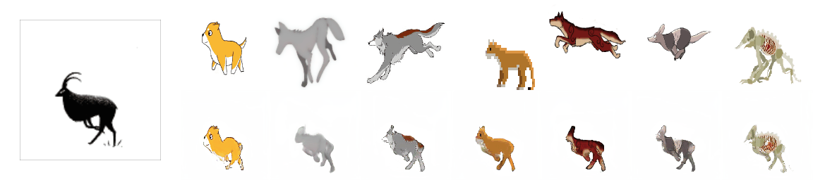

# Animating Arbitrary Objects via Deep Motion Transfer

This repository contains the source code for paper [Animating Arbitrary Objects via Deep Motion Transfer]().




### Requirements
You will need ```python3```.
```
pip install -r requirements.txt
```

### YAML configs

There are several config (```dataset_name.yaml```) files one for each dataset. Check ```actions.yaml``` for description of each individual parameter.

### Demo Transfer

In order to run a demo, use the following command:
```
python --config moving-gif.yaml --driving_video sup-mat/driving_video.gif --source_image sup-mat/source_image.gif --checkpoint path/to/checkpoint
```
The result will be stored in ```demo.gif```.

### Training

In order to train a model on specific dataset run:
```
CUDA_VISIBLE_DEVICES=0 python run.py dataset_name.yaml
```
This will create a folder in the log directory (each run will create a new directory).
Checkpoints will be saved in this folder.
You can check the loss values during training in ```log.txt```.
You can also check train-data reconstructions in the ```train-vis``` subfolder.

### Reconstruction

In order to check the reconstruction performance run:
```
CUDA_VISIBLE_DEVICES=0 python run.py dataset_name.yaml --mode reconstruction --checkpoint path/to/checkpoint
```
You will need to specify the path to the checkpoint,
the ```reconstruction``` subfolder will be created in the same folder as the checkpoint.
You can find the generated video there and in ```png``` subfolder loss-less verstion in '.png' format.

### Motion transfer

In order to perform motion transfer run:
```
CUDA_VISIBLE_DEVICES=0 python run.py dataset_name.yaml --mode transfer --checkpoint path/to/checkpoint
```
You will need to specify the path to the checkpoint,
the ```transfer``` subfolder will be created in the same folder as the checkpoint.
You can find the generated video there and its loss-less version in the ```png``` subfolder.

There are 2 different ways of performing transfer:
by using **absolute** keypoint locations or by using **relative** keypoint locations.

1) Absolute Transfer: the transfer is performed using the absolute postions of the driving video and appearance of the source image.
In this way there are no specific requirements for the driving video and source appearance that is used.
However this usually leads to poor performance since unrelevant details such as shape is transfered.
Check transfer parameters in ```shapes.yaml``` to enable this mode.

2) Realtive Transfer: from the driving video we first estimate the relative movement of each keypoint,
then we add this movement to the absolute position of keypoints in the source image.
This keypoint along with source image is used for transfer. This usually leads to better performance, however this requires
that the object in the first frame of the video and in the source image have the same pose.

The approximately aligned pairs of videos are given in the data folder. (e.g  ```data/taichi.csv```).

### Image-to-video translation

In order to perform image-to-video translation run:
```
CUDA_VISIBLE_DEVICES=0 python run.py dataset_name.yaml --mode prediction --checkpoint path/to/checkpoint
```
The following steps will be performed:
* Estimate the keypoints from the training set
* Train rnn to predict the keypoints
* Run the predictor for each video in the dataset, starting from the first frame.
Again the ```prediction``` subfolder will be created in the same folder as the checkpoint.
You can find the generated video there and in ```png``` subfolder.

### Datasets

1) **Shapes**. This dataset is saved along with repository.
Training takes about 1 hour.

2) **Actions**. This dataset is also saved along with repository.
 And training takes about 4 hours.

3) **Nemo**. The preprocessed version of this dataset can be [downloaded](https://yadi.sk/d/lHdX-fdMKVx2Dw).
 Training takes about 6 hours.

4) **Taichi**. We used the same data as [MoCoGAN](https://github.com/sergeytulyakov/mocogan). Training takes about 15 hours.

5) **Bair**. The preprocessed version of this dataset can be [downloaded](https://yadi.sk/d/Zjk9qbaf3occIw).
Training takes about 4 hours.

6) **MGif**. The preprocessed version of this dataset can be [downloaded](https://yadi.sk/d/5VdqLARizmnj3Q).
 [Check for details on this dataset](sup-mat/MGif/README.md). Training takes about 8 hours, on 2 gpu.

7) **Vox**. The dataset can be downloaded and preprocessed using a script:
``` cd data; ./get_vox.sh ```.


#### Additional notes

Citation:

```
```
