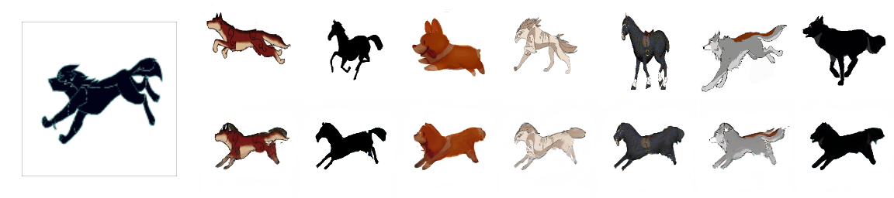

# Animating Arbitrary Objects via Deep Motion Transfer

This repository contains the source code for the CVPR oral paper [Animating Arbitrary Objects via Deep Motion Transfer](https://arxiv.org/abs/1812.08861) by Aliaksandr Siarohin, Stéphane Lathuilière, [Sergey Tulyakov](http://stulyakov.com), [Elisa Ricci](http://elisaricci.eu/) and [Nicu Sebe](http://disi.unitn.it/~sebe/). We  call  the proposed deep framework Monkey-Net,  as it enables motion transfer by considering MOviNg KEYpoints. Check also the project [website](http://www.stulyakov.com/papers/monkey-net.html).


New version of the method can be found [here](https://github.com/AliaksandrSiarohin/first-order-model). 

## Examples of motion transfer

The videos on the left show the driving videos. The first row on the right for each dataset shows the source images. The bottom row contains the animated sequences with motion transferred from the driving video and object taken from the source image. We trained a separate network for each task. Note that for each task the background, the object appearance are consistent in each generated video.

### NEMO Face Dataset

### Taichi Dataset

### BAIR Robot Dataset

### MGIF Dataset



## Training and testing

Our framework can be used in several modes. In the motion transfer mode, a static image will be animated using a driving video. In the image-to-video translation mode, given a static image, the framework will predict future frames.

### Installation

We support ```python3```. To install the dependencies run:
```
pip install -r requirements.txt
```

### YAML configs

There are several configuration (```config/dataset_name.yaml```) files one for each `dataset`. See ```config/actions.yaml``` to get description of each parameter.

### Motion Transfer Demo 

To run a demo, download a [checkpoint](https://yadi.sk/d/BX-hwuPEVm6iNw) and run the following command:
```
python demo.py --config  config/moving-gif.yaml --driving_video sup-mat/driving.png --source_image sup-mat/source.png --checkpoint path/to/checkpoint
```
The result will be stored in ```demo.gif```.

### Training

To train a model on specific dataset run:
```
CUDA_VISIBLE_DEVICES=0 python run.py --config config/dataset_name.yaml
```
The code will create a folder in the log directory (each run will create a time-stamped new directory).
Checkpoints will be saved to this folder.
To check the loss values during training in see ```log.txt```.
You can also check training data reconstructions in the ```train-vis``` subfolder.

### Reconstruction

To evaluate the reconstruction performance run:
```
CUDA_VISIBLE_DEVICES=0 python run.py --config config/dataset_name.yaml --mode reconstruction --checkpoint path/to/checkpoint
```
You will need to specify the path to the checkpoint,
the ```reconstruction``` subfolder will be created in the checkpoint folder.
The generated video will be stored to this folderenerated video there and in ```png``` subfolder loss-less verstion in '.png' format.

### Motion transfer

In order to perform motion transfer run:
```
CUDA_VISIBLE_DEVICES=0 python run.py --config config/dataset_name.yaml --mode transfer --checkpoint path/to/checkpoint
```
You will need to specify the path to the checkpoint,
the ```transfer``` subfolder will be created in the same folder as the checkpoint.
You can find the generated video there and its loss-less version in the ```png``` subfolder.

There are 2 different ways of performing transfer:
by using **absolute** keypoint locations or by using **relative** keypoint locations.

1) Absolute Transfer: the transfer is performed using the absolute postions of the driving video and appearance of the source image.
In this way there are no specific requirements for the driving video and source appearance that is used.
However this usually leads to poor performance since unrelevant details such as shape is transfered.
Check transfer parameters in ```shapes.yaml``` to enable this mode.

2) Realtive Transfer: from the driving video we first estimate the relative movement of each keypoint,
then we add this movement to the absolute position of keypoints in the source image.
This keypoint along with source image is used for transfer. This usually leads to better performance, however this requires
that the object in the first frame of the video and in the source image have the same pose.

The approximately aligned pairs of videos are given in the data folder. (e.g  ```data/taichi.csv```).

### Image-to-video translation

In order to perform image-to-video translation run:
```
CUDA_VISIBLE_DEVICES=0 python run.py --config config/dataset_name.yaml --mode prediction --checkpoint path/to/checkpoint
```
The following steps will be performed:
* Estimate the keypoints from the training set
* Train rnn to predict the keypoints
* Run the predictor for each video in the dataset, starting from the first frame.
Again the ```prediction``` subfolder will be created in the same folder as the checkpoint.
You can find the generated video there and in ```png``` subfolder.

### Datasets

1) **Shapes**. This dataset is saved along with repository.
Training takes about 1 hour.

2) **Actions**. This dataset is also saved along with repository.
 And training takes about 4 hours.

3) **Nemo**. The preprocessed version of this dataset can be [downloaded](https://yadi.sk/d/lHdX-fdMKVx2Dw).
 Training takes about 6 hours.

4) **Taichi**. We used the same data as [MoCoGAN](https://github.com/sergeytulyakov/mocogan). Training takes about 15 hours.

5) **Bair**. The preprocessed version of this dataset can be [downloaded](https://yadi.sk/d/Zjk9qbaf3occIw).
Training takes about 4 hours.

6) **MGif**. The preprocessed version of this dataset can be [downloaded](https://yadi.sk/d/5VdqLARizmnj3Q).
 [Check for details on this dataset](sup-mat/MGif/README.md). Training takes about 8 hours, on 2 gpu.

7) **Vox**. The dataset can be downloaded and preprocessed using a script:
``` cd data; ./get_vox.sh ```.

### Training on your own dataset
1) Resize all the videos to the same size e.g 128x128, the videos can be in '.gif' or '.mp4' format. But we recommend to make them stacked '.png' (see data/shapes), because this format is lossless.

2) Create a folder ```data/dataset_name``` with 2 subfolders ```train``` and ```test```, put training videos in the ```train``` and testing in the ```test```.

3) Create a config ```config/dataset_name.yaml``` (it is better to start from one of the existing configs, for 64x64 videos ```config/nemo.yaml```, for 128x128 ```config\moving-gif.yaml```, for 256x256 ```config\vox.yaml```), in dataset_params specify the root dir the ```root_dir:  data/dataset_name```. Also adjust the number of epoch in train_params.

#### Additional notes

Citation:

```
@InProceedings{Siarohin_2019_CVPR,
  author={Siarohin, Aliaksandr and Lathuilière, Stéphane and Tulyakov, Sergey and Ricci, Elisa and Sebe, Nicu},
  title={Animating Arbitrary Objects via Deep Motion Transfer},
  booktitle = {The IEEE Conference on Computer Vision and Pattern Recognition (CVPR)},
  month = {June},
  year = {2019}
}
```
